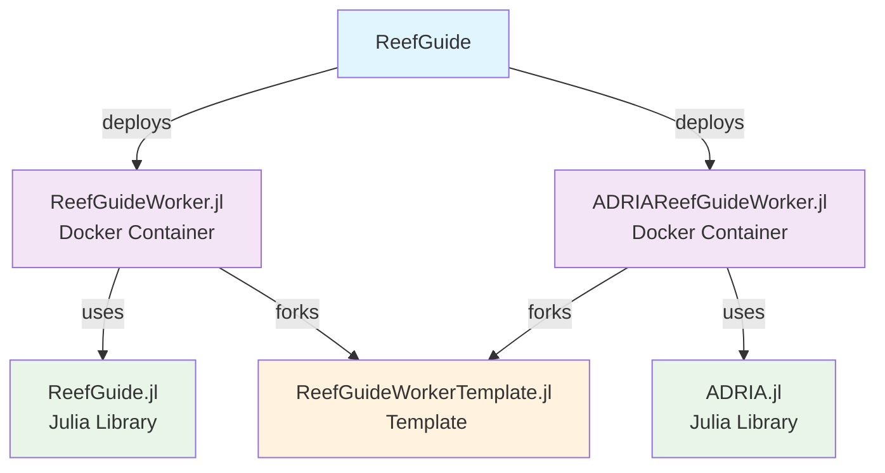

# ADRIAReefGuideWorker.jl

A specialized Julia worker for running ADRIA coral reef simulation models within the [ReefGuide](https://github.com/open-AIMS/reefguide) distributed job processing system. This is a prototype/proof-of-concept implementation that processes `ADRIA_MODEL_RUN` jobs.

## Where does it fit in?

ADRIAReefGuideWorker.jl is a worker node in the [reefguide](https://github.com/open-AIMS/reefguide) system. 

ReefGuide deploys `ReefGuideWorker.jl` and `ADRIAReefGuideWorker.jl` as Docker containers on ECS to consume jobs generated by users in the frontend. They each use their respective Julia library, and fork the template repository. Shown below.



Related repos include

- [ReefGuide](https://github.com/open-AIMS/reefguide) - the main ReefGuide repository
- [ReefGuideWorker.jl](https://github.com/open-AIMS/ReefGuideWorker.jl) - Julia Job Worker to run ReefGuide algorithms
- [ReefGuide.jl](https://github.com/open-AIMS/ReefGuide.jl) - ReefGuide Julia library code
- [ADRIA.jl](https://github.com/open-AIMS/ADRIA.jl) - The ADRIA model Julia library code, used by ADRIAReefGuideWorker.jl
- [ReefGuideWorkerTemplate.jl](https://github.com/open-AIMS/ReefGuideWorkerTemplate.jl) - A foundational template to implement Julia workers

## What It Does

The worker processes ADRIA model run jobs that:

- Load coral reef domain data from specified data packages
- Generate scenarios with customizable model parameters
- Run ADRIA coral reef simulations under different climate scenarios (RCP 2.6, 4.5, 8.5)
- Calculate coral cover metrics and generate visualizations
- Upload results to S3-compatible storage for analysis

Each job produces:

- Complete ADRIA result dataset
- VegaLite visualization specifications showing coral cover trends by scenario type

## Quick Start

### Prerequisites

- Julia 1.11.x via [juliaup](https://github.com/JuliaLang/juliaup)
- Access to a running ReefGuide API instance
- ADRIA-compatible reef domain data package

### Setup

1. Copy environment configuration:
   ```bash
   cp .env.dist .env
   ```
2. Update `.env` with your settings (see configuration below)
3. Initialize and start:
   ```bash
   cd sandbox/
   ./init.sh
   ./start.sh
   ```

## Configuration

Configure via environment variables in `.env`:

### ReefGuide Connection

- **`API_ENDPOINT`**: ReefGuide web API URL
- **`JOB_TYPES`**: Should be `ADRIA_MODEL_RUN`
- **`WORKER_USERNAME/PASSWORD`**: Authentication credentials

### Data Paths

- **`DATA_PACKAGE_PATH`**: Path to ADRIA domain data package (e.g. Moore reef cluster data)
- **`DATA_SCRATCH_SPACE`**: Working directory for temporary files

### ADRIA Library Settings

These are consumed directly by the ADRIA.jl library:

- **`ADRIA_OUTPUT_DIR`**: Where ADRIA writes simulation outputs
- **`ADRIA_NUM_CORES`**: Number of CPU cores for parallel processing
- **`ADRIA_DEBUG`**: Enable ADRIA debug logging
- **`ADRIA_THRESHOLD`**: Numerical threshold for ADRIA calculations

### Storage (Development)

For local development with MinIO:

- **`S3_ENDPOINT`**: MinIO endpoint (e.g. `http://localhost:9000`)
- **`MINIO_USERNAME/PASSWORD`**: MinIO credentials

## Example Job

Jobs specify:

- Number of scenarios to generate
- Custom model parameters (optional)
- RCP climate scenario (defaults to RCP 4.5)

The worker runs the full ADRIA simulation pipeline and returns paths to the generated results and visualizations in S3 storage.

## Docker

```bash
docker build . -t adria-worker
docker run --env-file .env adria-worker
```

---

Based on the [ReefGuideWorker julia template](https://github.com/open-AIMS/ReefGuideWorkerTemplate.jl) for the ReefGuide distributed computing system.
